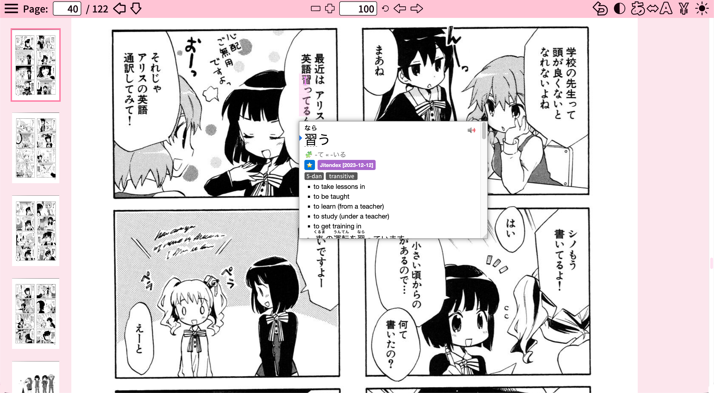

# CuteManga




CuteManga is a web interface to study Japanese in a funner way by reading your favorite manga.

You are responsible for filling it with your own content (covers, english manga, japanese manga with OCR text, and manga info).

CuteManga has many features to make your learning experience easier, such as a PDF viewer with a toggle to switch between the japanese and english version of the manga to reference the translations as you study. 

You can also toggle between top-to-bottom and right-to-left reading modes.

### Shortcuts

- Space: Switch between Japanese/English

### Design

Our design is available here: https://www.figma.com/design/T7EKhOdEwmeunR4V1QOGHT/CuteManga

### Effective Learning

To make effective use of this resource, you should at least know Hiragana, Katakana, and basic grammar. 

You should use [Anki](https://apps.ankiweb.net/) with the AnkiConnect extension and [Yomitan](https://yomitan.wiki/). In your Yomitan settings, enable the Anki integration so that you can add any words you don't know yet into an Anki deck for studying. 

Writing down the Kanji will make it easier to memorize them. You can use any note-taking app for this, but I use [Notability](https://notability.com/) on the ipad.

### Installation

First install Node.js if you don't have it already. 

https://nodejs.org/en/

The whole "database" is stored in the `database.js` file instead of using a real database for easy editing.

You can look at the `database.example.js` to see the structure of the database. Ignore the functions at the top you don't need to edit them (they generate links in the structure that we expect).

Clone the code from this repository and then install dependencies with `npm install --legacy-peer-deps`. 

Start the web server with `npm start`. 

Finally edit the pathname for the route `/Manga/*` in `server.ts` to the location of the manga folder on your hard drive.

### File Structure

The interface expects the following filesystem structure:

```
Manga
├── Manga Name 1
│   ├── English (PDF volumes)
│   ├── Japanese (PDF volumes)
│   └── Covers (JPG covers)
├── Manga Name 2
│   ├── English (PDF volumes)
│   ├── Japanese (PDF volumes)
│   └── Covers (JPG covers)
└── etc.
```

The name of every file in the folders should be "Manga Name (volume number)". 

You have to make sure that the English and Japanese manga are synced with the same number of pages. You can use the "PDF" function in my application to dump images from a PDF, edit them until they are synced, and merge it back into a PDF: [Pixel Compressor](https://github.com/Moebytes/Pixel-Compressor). 

Sometimes there will be "double pages", or a single page that actually contains two joined pages. You can use the "image" function in Pixel Compressor to split the double pages into singles.

You also need to make sure that the Japanese manga has OCR text so that you can select and store the words you don't yet know. These are some tools that can help OCR your manga and convert them to PDF with selectable text:

- [Mokuro](https://github.com/kha-white/mokuro)
- [Mokuro2Pdf](https://github.com/Kartoffel0/Mokuro2Pdf)

### Anime Version
- [CuteAnime](https://github.com/Moebytes/CuteAnime)
